<p align="center">
  
</p>

# ElonTracker

**An AI-powered analytics layer for post-count prediction markets.**

[Open ElonTracker](https://elon-tracker.com) · [Progress report](https://x.com/elon_tracker/status/2046605110122283144) · [X](https://x.com/elon_tracker)

    

ElonTracker turns public posting activity into structured market context. It combines real-time activity tracking, historical behavior, prediction-market prices, AI-generated signals, and Telegram delivery so traders can evaluate noisy event markets from one workspace.

> This is a public product and engineering showcase. Production source code, data-provider credentials, model prompts, signal thresholds, execution routing, and user data remain private.

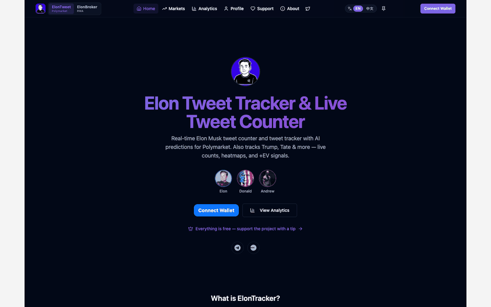

| Product | My contribution | Status | Core stack |
| --- | --- | --- | --- |
| Prediction-market research and signal workspace | Product strategy, UX, analytics, AI signals, Stripe billing, Telegram delivery, and operations | Live product | TypeScript, React, Python services, LLMs, Stripe, Telegram, Polymarket data |

## My role

I designed and shipped ElonTracker as an end-to-end product, not a dashboard mockup. My work covered product discovery, UX, data modeling, analytics, AI-assisted signals, payment infrastructure, Telegram delivery, wallet-aware flows, launch, and iteration after observing real user behavior.

| Area I owned | What I delivered |
| --- | --- |
| Product strategy | Narrowed a broad prediction toolkit into a clear workflow for post-count markets |
| Data engineering | Normalized activity events, market windows, prices, liquidity, and timestamps from independent sources |
| Analytics | Built counters, historical series, heatmaps, rolling behavior, backtests, and freshness states |
| Signal system | Joined forecast probability with market price, confidence, liquidity, and expiry |
| Frontend and UX | Designed a dense but readable research workspace across desktop and mobile |
| Payments | Integrated Stripe for the paid phase, including checkout, webhook-driven access state, and failure-safe entitlement handling |
| Distribution | Built Telegram alerts and deep links back into the relevant market context |
| Trading handoff | Connected users to official Polymarket infrastructure while keeping execution non-custodial |
| Operations | Shipped the public product, monitored product behavior, and changed the business model when retention data challenged the original assumptions |

## The problem

Post-count markets look simple, but useful decisions require several independent questions to be answered at once:

1. **What is happening now?** Current post count, recent velocity, and time remaining.
2. **Is the behavior unusual?** Hourly, daily, weekday, and rolling historical patterns.
3. **What is the market pricing?** Live probability, liquidity, spread, and available outcomes.
4. **Is there measurable edge?** A forecast must be compared with the market price, not viewed in isolation.
5. **Can the user act in time?** Signals lose value when context and execution live in separate tools.

ElonTracker connects these layers while keeping the final decision with the user.

## Reported product results

The following point-in-time metrics were published in the project's six-month progress report on **April 21, 2026**:

| Result | Reported value |
| --- | ---: |
| Monthly visitors | **3,000+** |
| Trading volume generated by users | **$68,000** |
| Telegram bot users | **688** |

These numbers are self-reported historical results from the linked [progress report](https://x.com/elon_tracker/status/2046605110122283144), not live counters or independently audited financial statements.

The report also documents the product's strategic shift: early feature expansion created attention but weak retention, so the experience was refocused around one value proposition — helping users find informational edge in noisy prediction markets.

## Real product screenshots

These screenshots were captured from the live public product on **October 2, 2026**. The values shown are point-in-time product data, not fabricated demo content or reconstructed mockups.

<table>
  <tr>
    <td width="50%">
      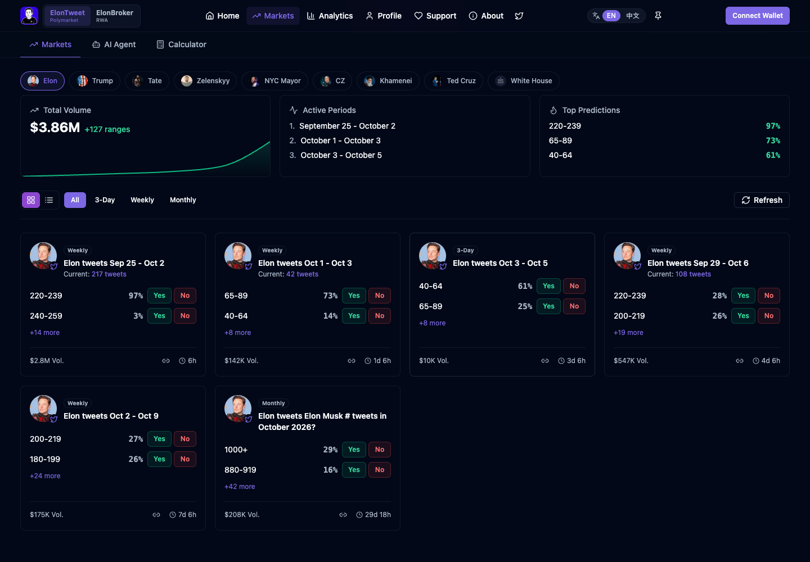
      <br /><strong>Market overview</strong><br />Active periods, probability ranges, volume, and time remaining in one scan-friendly view.
    </td>
    <td width="50%">
      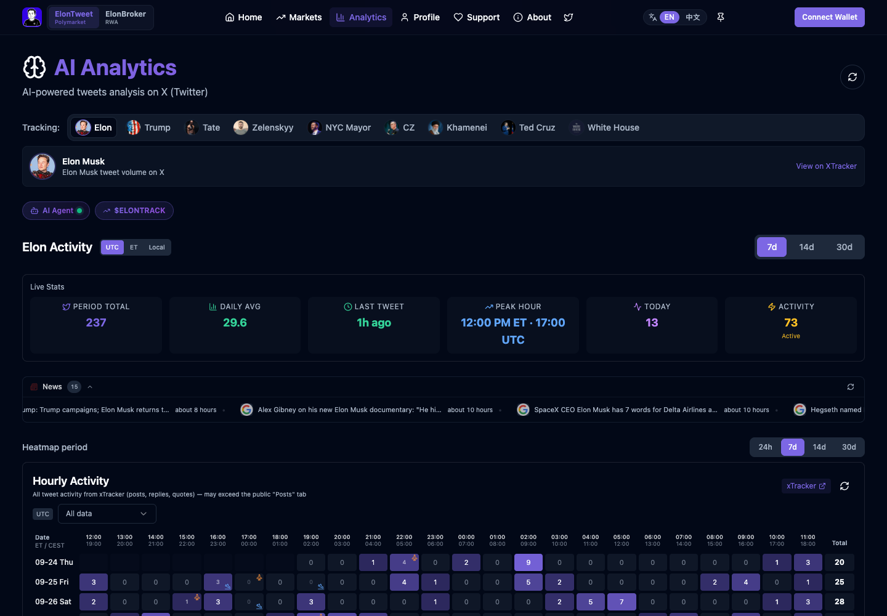
      <br /><strong>Activity analytics</strong><br />Live statistics and an hourly heatmap place current posting behavior in historical context.
    </td>
  </tr>
  <tr>
    <td width="50%">
      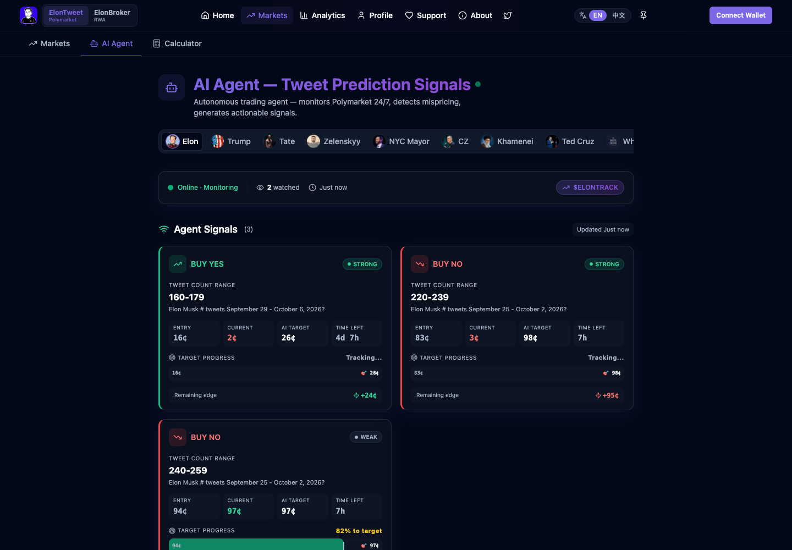
      <br /><strong>AI signal workspace</strong><br />Directional signals expose entry price, live price, target, confidence, and remaining time.
    </td>
    <td width="50%">
      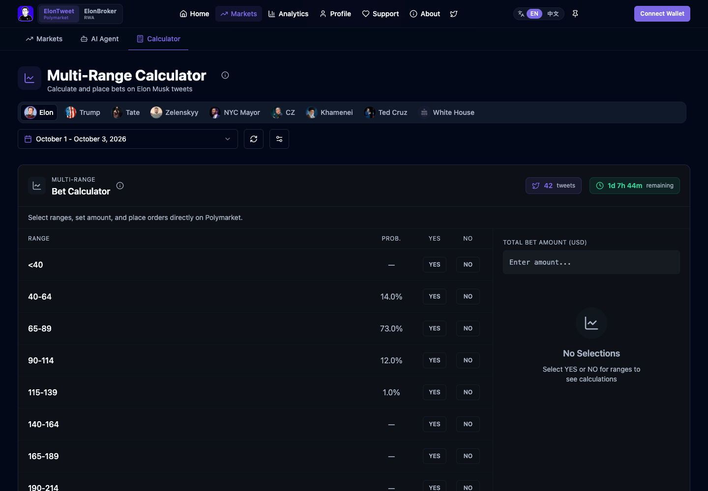
      <br /><strong>Multi-range calculator</strong><br />Users can compare outcomes and construct a position before handing execution to Polymarket.
    </td>
  </tr>
</table>

### Product expansion and monetization surface

<table>
  <tr>
    <td width="50%">
      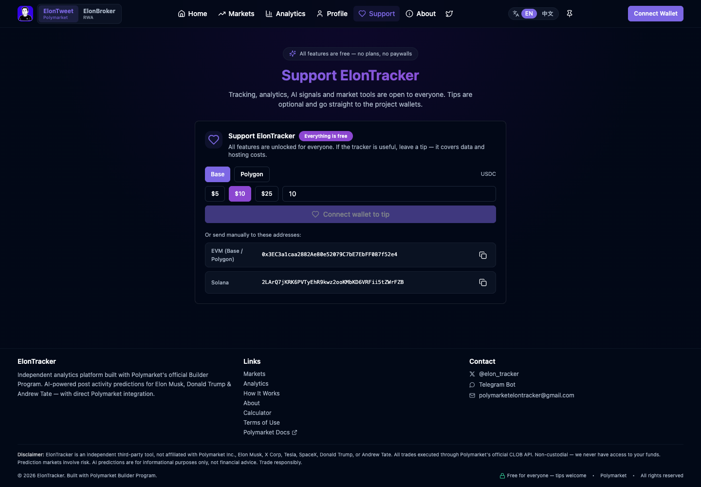
      <br /><strong>Current support model</strong><br />After testing paid access, the core product moved to free access with optional wallet-based support on Base, Polygon, and Solana.
    </td>
    <td width="50%">
      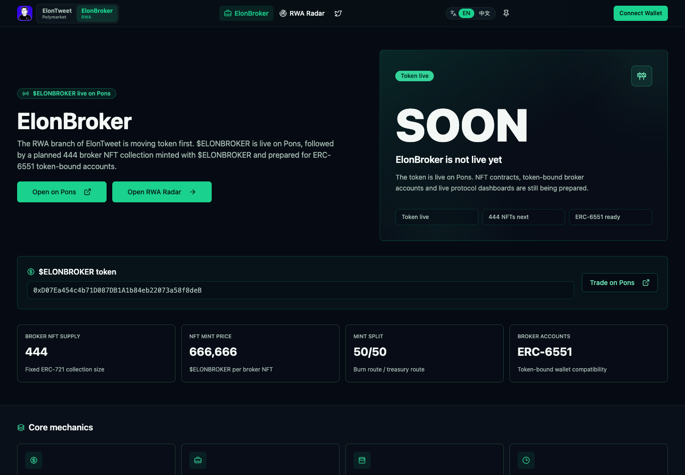
      <br /><strong>Adjacent product architecture</strong><br />The same product system extends into an RWA branch with token utility, an NFT roadmap, and ERC-6551-ready account design.
    </td>
  </tr>
</table>

## Product surface

| Surface | User outcome |
| --- | --- |
| Live activity | Track post counts, recent velocity, and current activity without manual counting |
| Historical analytics | Compare current behavior with hourly heatmaps, moving averages, and recurring patterns |
| Market overview | Read active post-count markets, prices, liquidity, and outcome ranges together |
| AI signals | Surface possible positive-expected-value opportunities with supporting context |
| Backtesting | Review historical signal behavior and PnL instead of judging only recent wins |
| Telegram bot | Receive concise market and signal updates away from the dashboard |
| EV calculator | Compare estimated probability with market price before taking a position |
| Trading handoff | Continue through official Polymarket infrastructure without giving the analytics layer custody of funds |

The current public product expands the same model beyond one account and supports multiple tracked public figures while preserving a consistent analytics vocabulary.

## Product flow

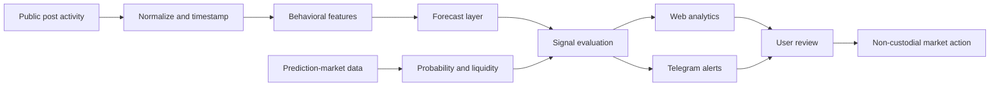

The forecast is only one input. Signal quality depends on joining it with market probability, liquidity, time remaining, and freshness before showing an opportunity.

## System architecture

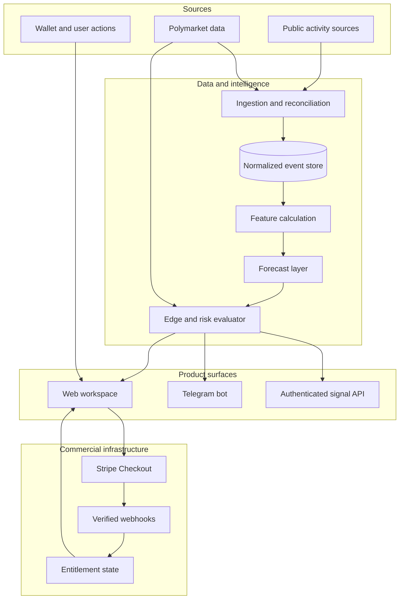

The boundaries are deliberate: collection does not decide; forecasting does not execute; billing does not trust the browser; and every user-facing signal carries enough provenance to explain when it was produced and when it expires.

## Core data model

The interface keeps measured facts, derived analytics, model output, and market state separate:

| Layer | Examples | Why it remains separate |
| --- | --- | --- |
| Observed activity | post timestamp, type, count, source | Raw facts must remain auditable |
| Derived behavior | hourly rate, rolling average, weekday profile | Analytics can be recalculated as history grows |
| Forecast | expected range, confidence, horizon | A model estimate is not a market fact |
| Market state | outcome, probability, liquidity, spread | Prices change independently from the forecast |
| Signal | direction, edge, expiry, rationale | A signal is the comparison between model and market |

Missing or stale values remain visible as unavailable rather than being replaced with a different metric.

## Signal lifecycle

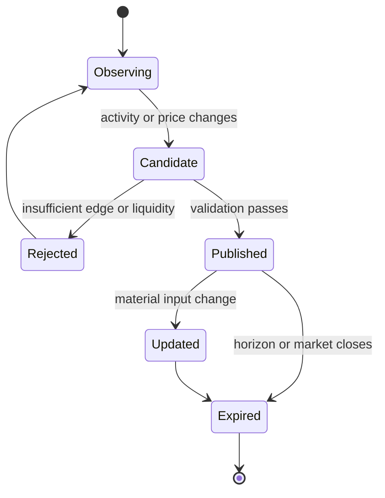

A published signal needs an explicit timestamp and expiry. Without those fields, users cannot distinguish a current opportunity from a correct but obsolete forecast.

## Engineering decisions

### Time normalization

All events are stored with a canonical timestamp. UTC is the analytical baseline; display time zones are a presentation preference. This prevents hourly patterns from changing when a user changes locale.

### Activity classification

Posts, replies, quotes, and other activity types may be counted differently by source or market rules. The ingestion boundary preserves the original type and applies an explicit counting policy instead of silently merging everything.

### Freshness as data

Activity snapshots, market quotes, and signals each carry their own observation time. A current market price paired with an old forecast is not presented as a live edge.

### Market mapping

Human-readable market titles are normalized into a structured contract: tracked account, time window, counting rule, outcome range, close time, and market identifier. Ambiguous markets are excluded from automated signal evaluation.

### Expected-value evaluation

The product compares an estimated probability with the market-implied probability, then applies liquidity, spread, confidence, and time-to-expiry checks. A directional prediction alone is not enough to become a signal.

### Delivery separation

The web application supports comparison and deep analysis. Telegram is used for short-lived alerts and links back to full context. The same signal identifier connects both surfaces and prevents duplicate notifications.

### Non-custodial execution

ElonTracker supplies analytics and an execution handoff. Wallet authorization and final submission remain explicit user actions through supported market infrastructure.

## Monetization and Stripe

I integrated Stripe during the paid-access phase of ElonTracker. The important work was not the checkout button; it was keeping payment state, application access, retries, and cancellation behavior consistent across systems.

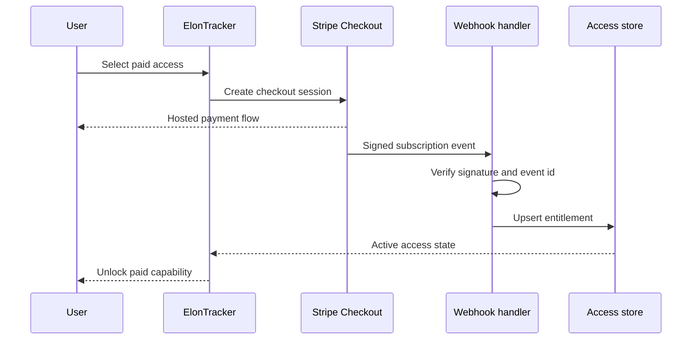

The integration was designed around four rules:

- **Server-authoritative access:** a success redirect never grants access by itself.
- **Verified webhooks:** subscription state changes are accepted only after signature verification.
- **Idempotency:** repeated Stripe events cannot create duplicate access records or side effects.
- **Explicit lifecycle states:** trialing, active, past due, canceled, and expired remain distinct.

The product later moved from subscriptions to free access with optional tips. That was a product decision informed by activation and retention, not a technical limitation. The Stripe integration remains evidence that I can build billing correctly, while the pivot demonstrates that I do not protect an implementation when the product data argues for a simpler model.

## Selected implementation patterns

The production repository is private. The excerpts below are sanitized, representative versions of the boundaries used in the product; secrets, provider-specific routing, prompts, and proprietary scoring logic are intentionally omitted.

### 1. Freshness-aware signal evaluation

```ts
type EvaluationInput = {
  forecast: { probability: number; confidence: number; observedAt: Date };
  market: { probability: number; liquidityUsd: number; observedAt: Date };
  closesAt: Date;
};

export function evaluateCandidate(input: EvaluationInput, now: Date) {
  const forecastAgeMs = now.getTime() - input.forecast.observedAt.getTime();
  const marketAgeMs = now.getTime() - input.market.observedAt.getTime();
  const expiresInMs = input.closesAt.getTime() - now.getTime();
  const edge = input.forecast.probability - input.market.probability;

  if (forecastAgeMs > FORECAST_TTL_MS) return { state: "stale_forecast" };
  if (marketAgeMs > QUOTE_TTL_MS) return { state: "stale_market" };
  if (expiresInMs <= MIN_EXECUTION_WINDOW_MS) return { state: "too_late" };
  if (input.market.liquidityUsd < MIN_LIQUIDITY_USD) return { state: "thin_market" };
  if (input.forecast.confidence < MIN_CONFIDENCE) return { state: "low_confidence" };

  return { state: "eligible", direction: edge >= 0 ? "yes" : "no", edge };
}
```

Why this matters: a good forecast paired with an old quote is not a live opportunity. Freshness is evaluated as part of the domain model instead of being shown only as decorative UI metadata.

### 2. Idempotent Stripe webhook boundary

```ts
export async function handleStripeWebhook(rawBody: string, signature: string) {
  const event = stripe.webhooks.constructEvent(
    rawBody,
    signature,
    env.STRIPE_WEBHOOK_SECRET,
  );

  await database.transaction(async (tx) => {
    if (await tx.processedEvents.exists(event.id)) return;

    const update = mapStripeEventToEntitlement(event);
    if (update) await tx.entitlements.upsert(update);

    await tx.processedEvents.insert({
      id: event.id,
      processedAt: new Date(),
    });
  });
}
```

Why this matters: Stripe retries delivery. Processing the same event twice must be harmless, and browser redirects must never become the source of truth for paid access.

### 3. Auditable UI state instead of silent fallbacks

```tsx
type MetricState<T> =
  | { status: "ready"; value: T; observedAt: string; source: string }
  | { status: "stale"; lastValue: T; observedAt: string; source: string }
  | { status: "unavailable"; reason: "provider" | "unsupported" | "empty" };

function MarketProbability({ metric }: { metric: MetricState<number> }) {
  if (metric.status === "unavailable") return <Unavailable reason={metric.reason} />;
  return (
    <Metric
      value={formatPercent(metric.status === "ready" ? metric.value : metric.lastValue)}
      source={metric.source}
      timestamp={metric.observedAt}
      stale={metric.status === "stale"}
    />
  );
}
```

Why this matters: substituting a different metric when data is missing creates confident-looking misinformation. The interface preserves source, timestamp, and unavailable states all the way to the component.

## Public signal contract

The public product documents an authenticated signal endpoint. A response can be modeled around a compact, provenance-aware contract:

```ts
type MarketSignal = {
  id: string;
  handle: string;
  marketId: string;
  direction: "yes" | "no";
  marketProbability: number;
  estimatedProbability: number;
  expectedValue: number;
  confidence: number;
  observedAt: string;
  expiresAt: string;
};
```

The published endpoint requires an API key. Credentials, private scoring features, thresholds, and provider routing are intentionally excluded from this repository.

## UI rationale

| UI decision | Reasoning |
| --- | --- |
| Activity first | Users need the measured count before interpreting a forecast |
| UTC visible by default | Market windows and historical buckets need one stable reference |
| Forecast beside price | Edge is understandable only when the estimate and market probability are comparable |
| Heatmaps for rhythm | Posting behavior is strongly time-dependent and easier to scan spatially |
| Confidence and expiry | A signal without uncertainty or lifetime looks more certain than it is |
| Consistent tracked-person selector | The analytical model scales to multiple accounts without changing navigation |
| Telegram for alerts | High-urgency updates benefit from push delivery; dense research stays on the web |
| Non-custodial trade action | Analytics should never disguise the moment a user authorizes a market transaction |

## Reliability and evaluation

The highest-risk boundaries deserve separate checks:

- duplicate and deleted-post reconciliation;
- source-lag and stale-snapshot detection;
- UTC bucket and market-window boundary tests;
- counting-rule fixtures for posts, replies, and quotes;
- market identity and close-time validation;
- backtests that prevent future information from leaking into historical predictions;
- signal deduplication, expiry, and Telegram retry handling;
- calibration and PnL reporting that retain losing signals;
- explicit empty, delayed, unsupported, and provider-error states.

## Technology snapshot

| Area | Implementation responsibility |
| --- | --- |
| Client | Responsive application, reusable analytical primitives, mobile states, and installable app surface |
| Data | Event ingestion, normalization, reconciliation, freshness tracking, and historical aggregation |
| Analytics | Real-time counters, time-series views, heatmaps, moving averages, and leakage-safe backtests |
| Intelligence | AI-assisted forecasting separated from price, liquidity, and signal eligibility |
| Markets | Polymarket market discovery, normalized outcome ranges, live context, and official execution handoff |
| Payments | Stripe Checkout, signed webhook processing, idempotency, and entitlement lifecycle during the paid phase |
| Delivery | Web workspace, Telegram alerts, deep links, and an authenticated signal API |
| Wallet model | Explicit user authorization and non-custodial interaction boundaries |
| Reliability | Source attribution, canonical timestamps, stale states, retries, deduplication, and observable failures |

## Product judgment, not only implementation

The strongest lesson from ElonTracker was that shipping more features is not the same as creating more value. The first phase proved demand and distribution. The next phase reduced the product to a clearer promise, simplified access, and concentrated the interface around the decisions users repeatedly made.

That iteration demonstrates the full scope of the work:

- turning an ambiguous market behavior into a structured product domain;
- shipping enough infrastructure to charge for access through Stripe;
- measuring whether paid complexity improved retention;
- removing friction when the evidence favored reach and repeated usage;
- preserving optional monetization without weakening the core experience;
- expanding the underlying product system into additional tracked figures and an RWA branch.

## What stays private

This repository intentionally excludes:

- production source code and deployment configuration;
- API keys, bot credentials, wallet secrets, and webhook configuration;
- data-provider routing and collection workarounds;
- feature weights, prompts, model parameters, and signal thresholds;
- private user, subscription, referral, and trading records;
- anti-abuse logic and internal operational dashboards.

## Disclaimer

ElonTracker is an independent analytics product and is not affiliated with Elon Musk, X Corp, Tesla, SpaceX, or Polymarket. Prediction markets involve risk. Forecasts and signals are informational, not financial advice.

## Author

Built by [0xENTYPER](https://github.com/0xENTYPER).
