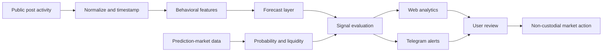
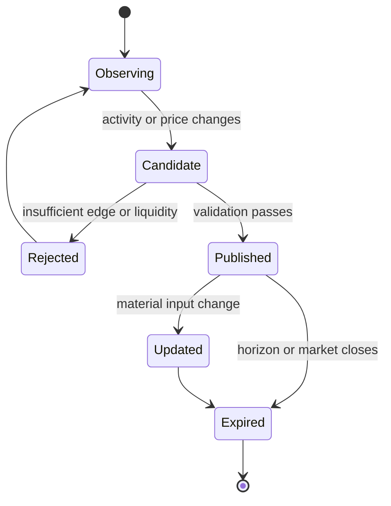

<p align="center">
  
</p>

# ElonTracker

**An AI-powered analytics layer for post-count prediction markets.**

[Open ElonTracker](https://elon-tracker.com) · [Progress report](https://x.com/elon_tracker/status/2046605110122283144) · [X](https://x.com/elon_tracker)

ElonTracker turns public posting activity into structured market context. It combines real-time activity tracking, historical behavior, prediction-market prices, AI-generated signals, and Telegram delivery so traders can evaluate noisy event markets from one workspace.

> This is a public product and engineering showcase. Production source code, data-provider credentials, model prompts, signal thresholds, execution routing, and user data remain private.

## The problem

Post-count markets look simple, but useful decisions require several independent questions to be answered at once:

1. **What is happening now?** Current post count, recent velocity, and time remaining.
2. **Is the behavior unusual?** Hourly, daily, weekday, and rolling historical patterns.
3. **What is the market pricing?** Live probability, liquidity, spread, and available outcomes.
4. **Is there measurable edge?** A forecast must be compared with the market price, not viewed in isolation.
5. **Can the user act in time?** Signals lose value when context and execution live in separate tools.

ElonTracker connects these layers while keeping the final decision with the user.

## Reported product results

The following point-in-time metrics were published in the project's six-month progress report on **April 21, 2026**:

| Result | Reported value |
| --- | ---: |
| Monthly visitors | **3,000+** |
| Trading volume generated by users | **$68,000** |
| Telegram bot users | **688** |

These numbers are self-reported historical results from the linked [progress report](https://x.com/elon_tracker/status/2046605110122283144), not live counters or independently audited financial statements.

The report also documents the product's strategic shift: early feature expansion created attention but weak retention, so the experience was refocused around one value proposition — helping users find informational edge in noisy prediction markets.

## Product surface

| Surface | User outcome |
| --- | --- |
| Live activity | Track post counts, recent velocity, and current activity without manual counting |
| Historical analytics | Compare current behavior with hourly heatmaps, moving averages, and recurring patterns |
| Market overview | Read active post-count markets, prices, liquidity, and outcome ranges together |
| AI signals | Surface possible positive-expected-value opportunities with supporting context |
| Backtesting | Review historical signal behavior and PnL instead of judging only recent wins |
| Telegram bot | Receive concise market and signal updates away from the dashboard |
| EV calculator | Compare estimated probability with market price before taking a position |
| Trading handoff | Continue through official Polymarket infrastructure without giving the analytics layer custody of funds |

The current public product expands the same model beyond one account and supports multiple tracked public figures while preserving a consistent analytics vocabulary.

## Product flow



The forecast is only one input. Signal quality depends on joining it with market probability, liquidity, time remaining, and freshness before showing an opportunity.

## Core data model

The interface keeps measured facts, derived analytics, model output, and market state separate:

| Layer | Examples | Why it remains separate |
| --- | --- | --- |
| Observed activity | post timestamp, type, count, source | Raw facts must remain auditable |
| Derived behavior | hourly rate, rolling average, weekday profile | Analytics can be recalculated as history grows |
| Forecast | expected range, confidence, horizon | A model estimate is not a market fact |
| Market state | outcome, probability, liquidity, spread | Prices change independently from the forecast |
| Signal | direction, edge, expiry, rationale | A signal is the comparison between model and market |

Missing or stale values remain visible as unavailable rather than being replaced with a different metric.

## Signal lifecycle



A published signal needs an explicit timestamp and expiry. Without those fields, users cannot distinguish a current opportunity from a correct but obsolete forecast.

## Engineering decisions

### Time normalization

All events are stored with a canonical timestamp. UTC is the analytical baseline; display time zones are a presentation preference. This prevents hourly patterns from changing when a user changes locale.

### Activity classification

Posts, replies, quotes, and other activity types may be counted differently by source or market rules. The ingestion boundary preserves the original type and applies an explicit counting policy instead of silently merging everything.

### Freshness as data

Activity snapshots, market quotes, and signals each carry their own observation time. A current market price paired with an old forecast is not presented as a live edge.

### Market mapping

Human-readable market titles are normalized into a structured contract: tracked account, time window, counting rule, outcome range, close time, and market identifier. Ambiguous markets are excluded from automated signal evaluation.

### Expected-value evaluation

The product compares an estimated probability with the market-implied probability, then applies liquidity, spread, confidence, and time-to-expiry checks. A directional prediction alone is not enough to become a signal.

### Delivery separation

The web application supports comparison and deep analysis. Telegram is used for short-lived alerts and links back to full context. The same signal identifier connects both surfaces and prevents duplicate notifications.

### Non-custodial execution

ElonTracker supplies analytics and an execution handoff. Wallet authorization and final submission remain explicit user actions through supported market infrastructure.

## Public signal contract

The public product documents an authenticated signal endpoint. A response can be modeled around a compact, provenance-aware contract:

```ts
type MarketSignal = {
  id: string;
  handle: string;
  marketId: string;
  direction: "yes" | "no";
  marketProbability: number;
  estimatedProbability: number;
  expectedValue: number;
  confidence: number;
  observedAt: string;
  expiresAt: string;
};
```

The published endpoint requires an API key. Credentials, private scoring features, thresholds, and provider routing are intentionally excluded from this repository.

## UI rationale

| UI decision | Reasoning |
| --- | --- |
| Activity first | Users need the measured count before interpreting a forecast |
| UTC visible by default | Market windows and historical buckets need one stable reference |
| Forecast beside price | Edge is understandable only when the estimate and market probability are comparable |
| Heatmaps for rhythm | Posting behavior is strongly time-dependent and easier to scan spatially |
| Confidence and expiry | A signal without uncertainty or lifetime looks more certain than it is |
| Consistent tracked-person selector | The analytical model scales to multiple accounts without changing navigation |
| Telegram for alerts | High-urgency updates benefit from push delivery; dense research stays on the web |
| Non-custodial trade action | Analytics should never disguise the moment a user authorizes a market transaction |

## Reliability and evaluation

The highest-risk boundaries deserve separate checks:

- duplicate and deleted-post reconciliation;
- source-lag and stale-snapshot detection;
- UTC bucket and market-window boundary tests;
- counting-rule fixtures for posts, replies, and quotes;
- market identity and close-time validation;
- backtests that prevent future information from leaking into historical predictions;
- signal deduplication, expiry, and Telegram retry handling;
- calibration and PnL reporting that retain losing signals;
- explicit empty, delayed, unsupported, and provider-error states.

## Technology snapshot

| Area | Publicly visible approach |
| --- | --- |
| Client | Responsive web application and installable app surface |
| Analytics | Real-time counters, historical series, heatmaps, moving averages, and backtests |
| Intelligence | AI-assisted forecast and positive-EV signal layer |
| Markets | Polymarket market data and official execution infrastructure |
| Delivery | Web dashboard, Telegram bot, and authenticated signal API |
| Wallet model | Non-custodial user authorization |
| Data discipline | Source attribution, freshness, explicit time zones, and historical evaluation |

## What stays private

This repository intentionally excludes:

- production source code and deployment configuration;
- API keys, bot credentials, wallet secrets, and webhook configuration;
- data-provider routing and collection workarounds;
- feature weights, prompts, model parameters, and signal thresholds;
- private user, subscription, referral, and trading records;
- anti-abuse logic and internal operational dashboards.

## Disclaimer

ElonTracker is an independent analytics product and is not affiliated with Elon Musk, X Corp, Tesla, SpaceX, or Polymarket. Prediction markets involve risk. Forecasts and signals are informational, not financial advice.

## Author

Built by [@elon_tracker](https://x.com/elon_tracker).
